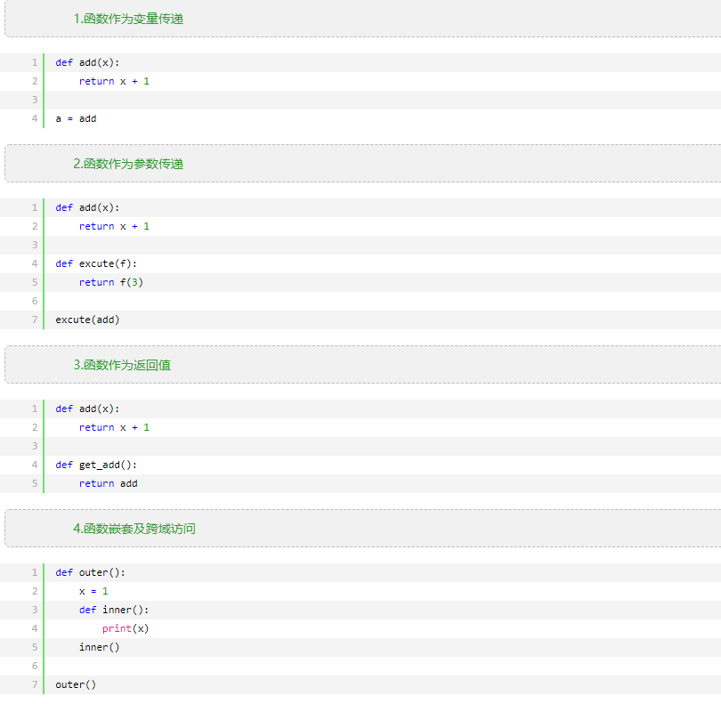
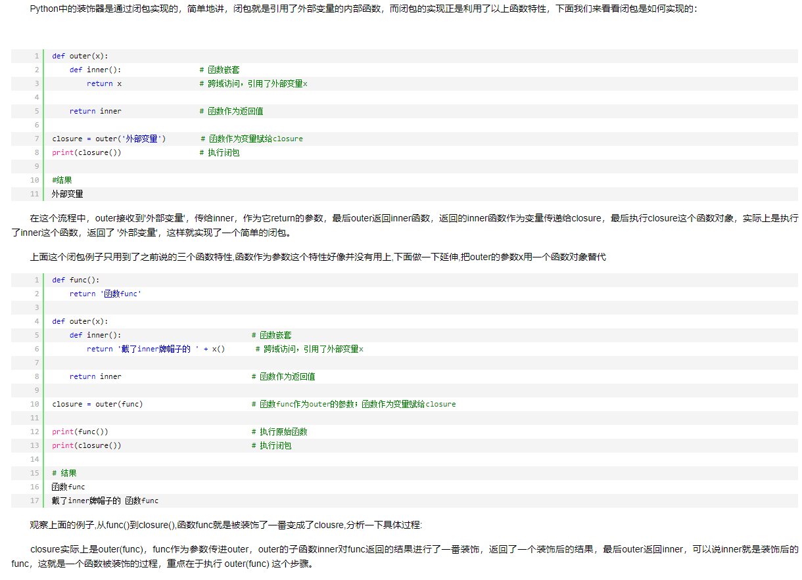
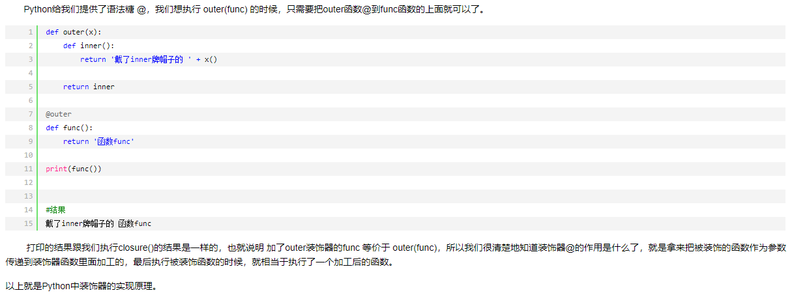

## 1函数特性

Python中的函数特性总的来说有四点:




## 2 闭包的实现



## 3 装饰器语法糖@



## 4 装饰器的使用

Python中装饰器用处很多,下面写一个例子感受一下.

类中的私有属性在类外部是无法访问的(就当无法访问好了,毕竟鬼叔是不推荐访问的),而这时可以在类中定义一个方法返回这个私有属性然后在外部调用就可以得到这个私有属性,但是这样看起来就和正常的调用属性的方式不一样了(obj.属性),这时候就可以用@property来实现想要的效果.

```python
class Person:
    def __init__(self,name,age):
        self.name = name
        if type(age) is int:
            self.__age = age
        else:
            print( '你输入的年龄的类型有误,请输入数字')
    @property
    def age(self):
        return self.__age

    @age.setter
    def age(self,a):
        '''判断,你修改的年龄必须是数字'''
        if type(a) is int:
            self.__age = a
        else:
            print('你输入的年龄的类型有误,请输入数字')

    @age.deleter
    def age(self):
        del self.__age


p1 = Person('帅哥',20)
print(p1.age)
del p1.age
```