## 1 介绍

## 2 光线和颜色

图片是什么

在计算机中，是一个三维的张量（彩色），二维张量（黑白）

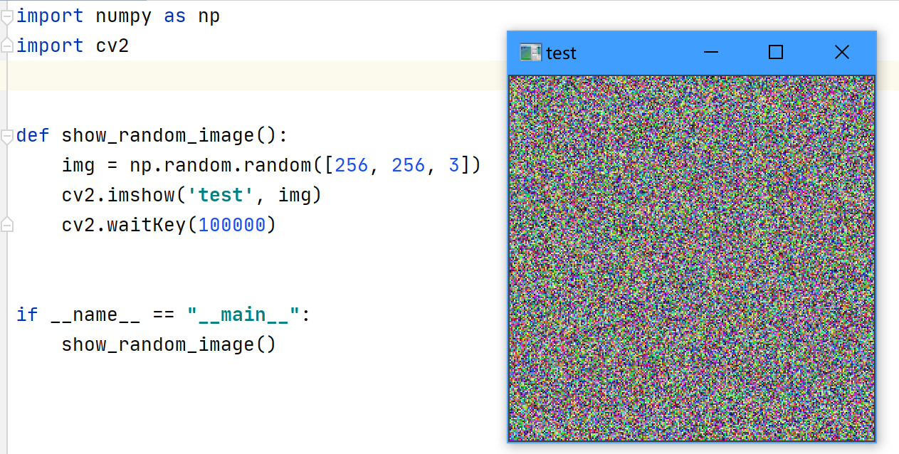

图像的维度

以 256*256 的 8bit 黑白图像为例

那么它的维度为 256 * 256 * 2^8 = 2^24 

即计算机视觉任务处理的数据是一个非常高维度的空间中

## 3 滤波器

空域中的图像滤波器

-   平滑，锐化，测量纹理

频域中的图像滤波器

-   修改图像的频率
-   去噪，采样，图像压缩

图像金字塔

-   coarse-to-fine

滤波器定义

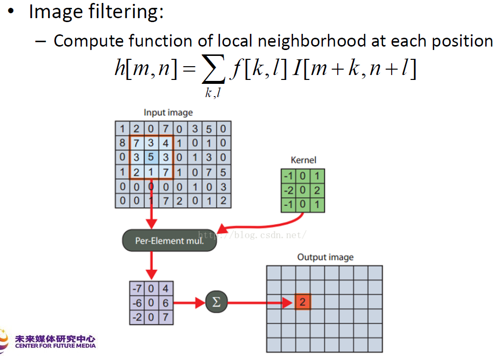

一些典型滤波器

box filter 

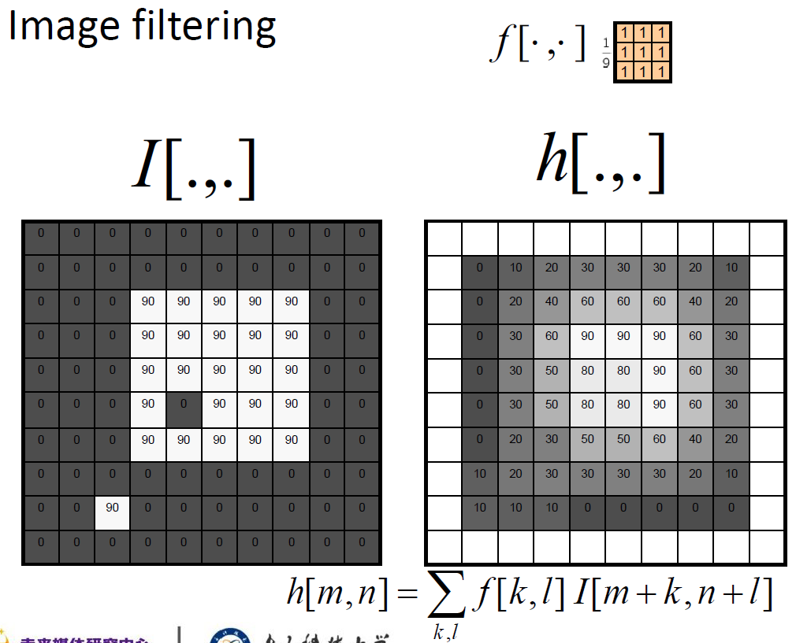

将每个像素点替换成相邻像素点的平均值，达到了**去除尖锐特征**的效果

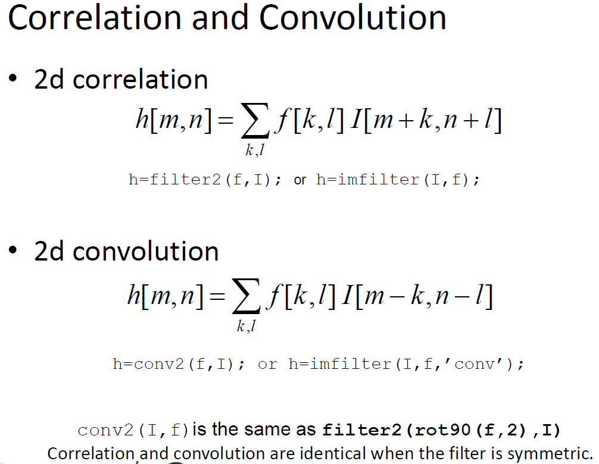

相关和卷积 ，当滤波器是对称的时候，相关和卷积是相同的

线性滤波器的特征：

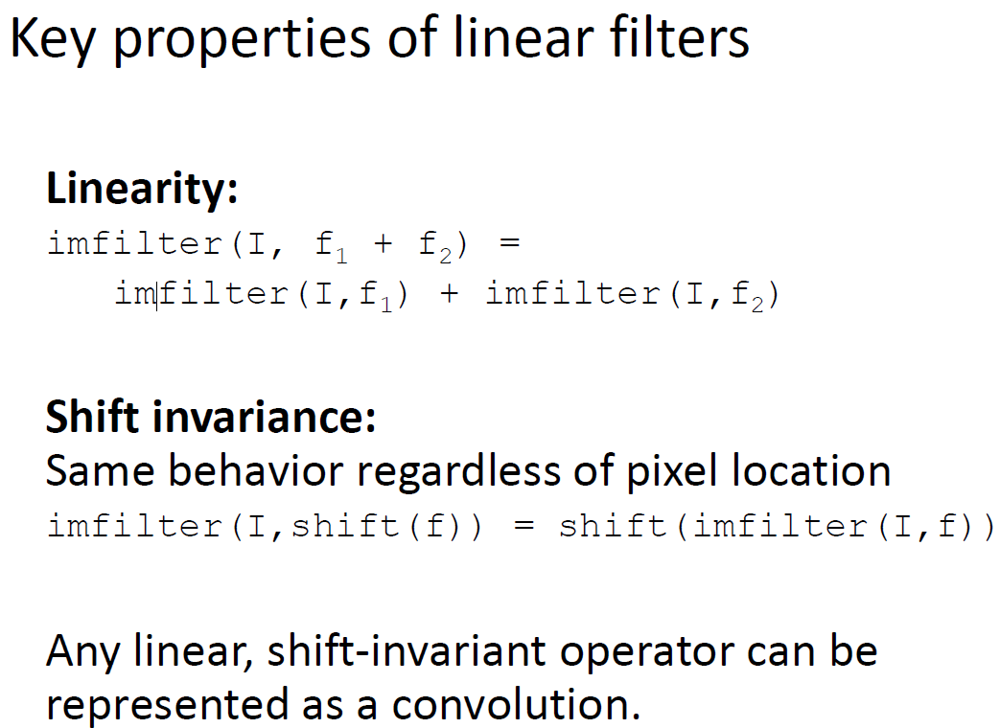

-   线性
-   平移不变性
-   任何线性的、移位不变的算子都可以表示为卷积

卷积的特征

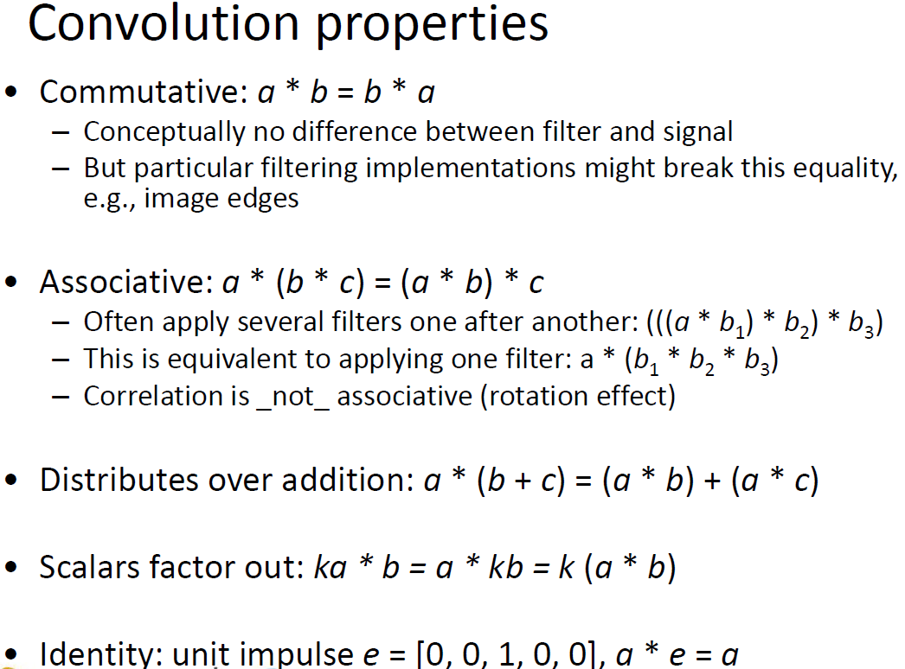

-   交换律
-   结合律
-   分配律

重要的滤波器，高斯滤波

邻近像素的权重贡献

-   去除图像中的高频部分，使图像变得比 box filter 更平滑

-   高斯加上高斯也为高斯：所以两个小内核的高斯滤波重复可以得到大内核的高斯滤波一样的效果

-   可以分解为两个一维高斯的乘积

可分离性的用处：

可以加速运算，2 维卷积，可分离式卷积

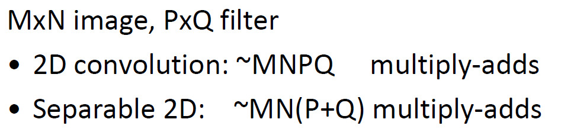

滤波器的大小为奇数

滤波器矩阵的所有元素和应该要等与 1，为了保证滤波前后图像的亮度不变。如果大于 1 ，图像会更亮，反之会更暗。如果和为 0，图像不会黑，但是会非常暗。

滤波后结果为负数或者大于255，截断或取绝对值。

协相关和卷积式图像处理最基本的操作，都是线性的，具有平移不变性

卷积和协相关的差别是，卷积需要先对滤波矩阵进行 180 度的翻转，如果矩阵式对称的，两者没有差别

平移不变性指我们在图像的每个位置都执行相同的操作。线性指这个操作式线性的，用每个像素的领域的线性组合来替代这个像素。

二维卷积过程是 4 层循环计算过程（卷积二层，图像两层（单通道）），不快，如果卷积核分离成一维的可以加快运算速度。

非线性滤波器

中值滤波：中值滤波就是排序。

频域

为什么一张低分辨率图像任然能传达信息，丢失的信息是什么？

一张混合图像，从远处看和从近处看，为啥能得到不一样的结果

混合图像是静态图像，其观感随观看距离的变化而变化。基本的想法是，当高频信号可用时，它倾向于主导感知，但是，在远处，只能看到信号的低频(平滑)部分。通过混合一幅图像的高频部分和另一幅图像的低频部分，你会得到一幅混合图像，在不同的距离会产生不同的观感。

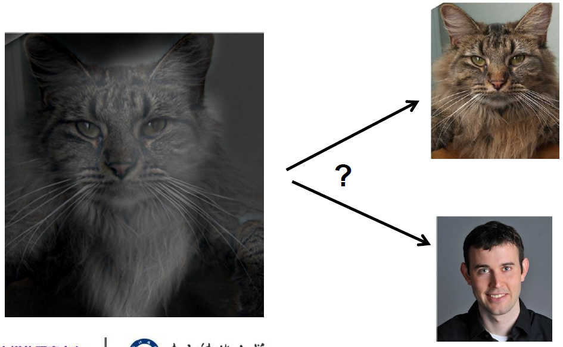

奈奎斯特-香农采样定理

用离散的方式采样一个信号，采样频率必须大于等于 2 倍的 fmax

fmax 为输入信号的最大频率。

只有这样才能保证从采样信号重建原始信号

## 4 04和 05 ppt没有看，太烦了。。。。。

## 5 特征检测与匹配

一张大的图片，先进行 feature detection 用 DoG，然后进行 feature description 用 sift，然后结合 local descriptors 进行 matching， indexing，detection

边缘检测

-   目标：识别图像中的视觉变化(不连续性)。
-   直观地说，语义信息被编码在边缘中。
-   造成视觉边缘的“原因”是什么? 边缘由一系列的原因造成的
    -   表面正常的不连续
    -   深度不连续
    -   表面颜色不连续
    -   光照不连续

边缘可以用来做什么

-   提取信息，识别目标
-   帮助恢复几何和视点

描述边缘 ：边缘是图像强度函数中变化很快的地方

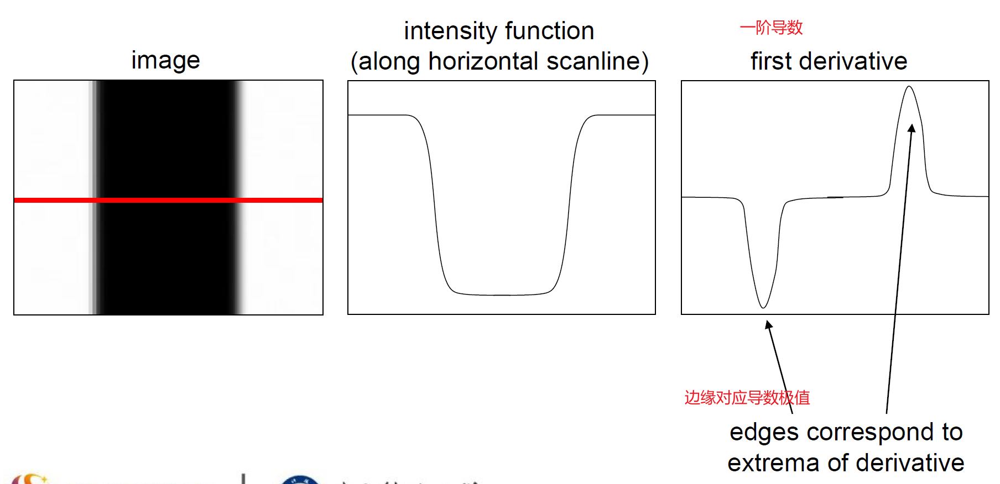

但是噪声对边缘检测存在很大的影响

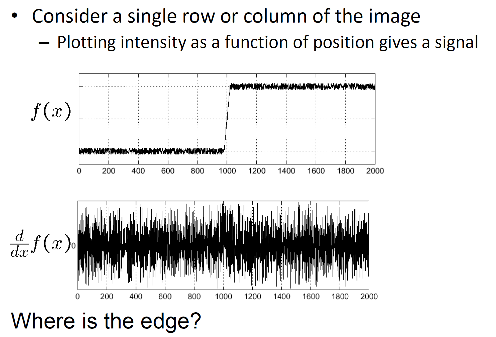

比如上述情况下，就无法从一阶导数函数种找到边缘信息，也就是说，差分滤波器对噪声有很强的响应。图像噪声导致像素看起来与它们的邻居非常不同。

一般情况下，噪音越大，响应越强

该如何办呢？

再加上高斯滤波

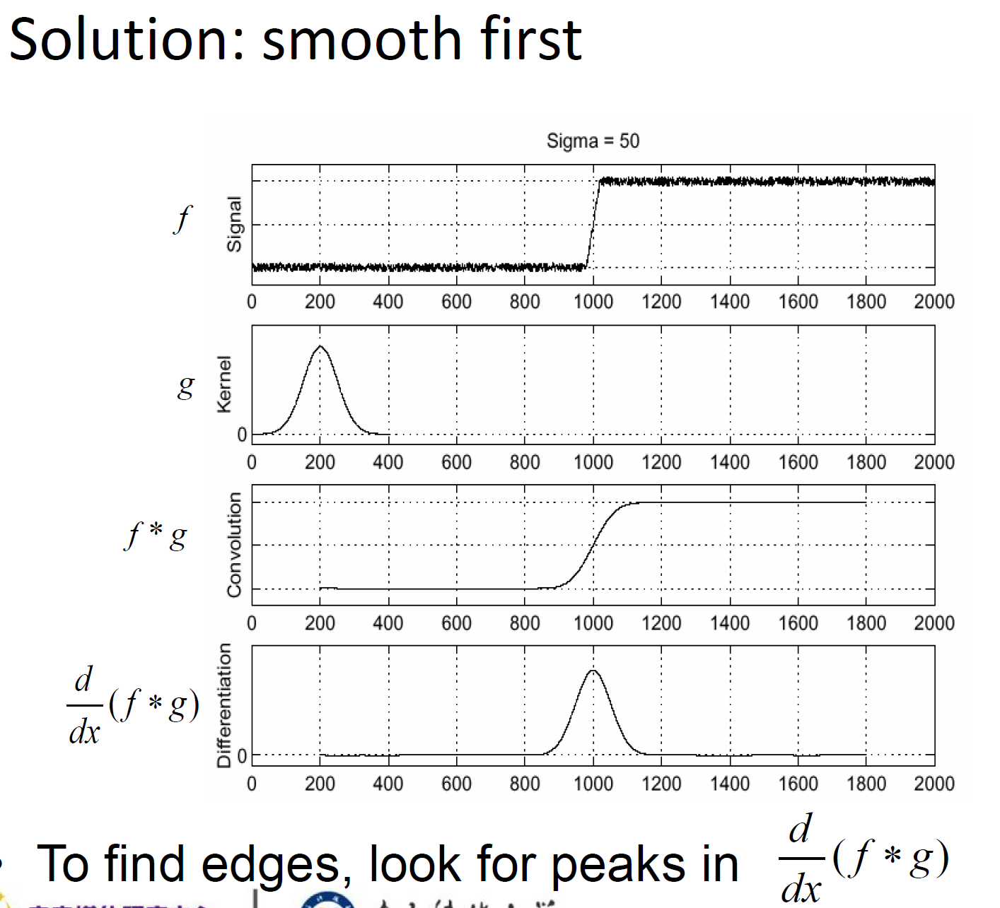

平滑和局部化之间的权衡

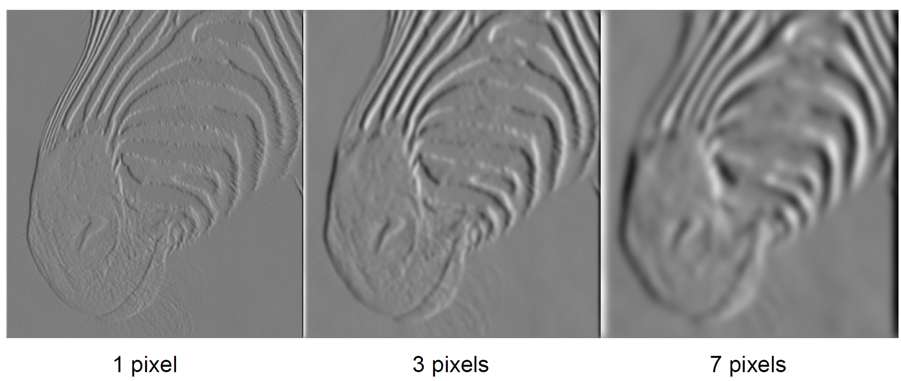

平滑导数去除噪声，但模糊边缘。在不同的尺度找到边缘。平滑越厉害，找到边缘的尺度越大。

设计一个边缘探测器

好的边缘检测器的原则

-   很好的探测：好的检测器能够找到所有的真实边缘，忽略噪声和其他因素
-   很好的定位：
    -   检测的边缘必须尽可能的和真实边缘相近
    -   对于每个真边缘点，检测器必须只返回一个点

边缘检测线索

-   边界上颜色、强度或纹理的差异
-   连续性和关闭
-   高阶信息

边缘检测现状

-   局部边缘检测效果较好
-   一些方法考虑到较长的轮廓
-   从数据中“学习”的现代方法。深度学习
-   对象和高级信息使用不当。

Canny 边缘检测器

-   可能是计算机视觉中应用最广泛的边缘检测器。
-   理论模型:阶跃边被加性高斯噪声破坏。
-   Canny 证明了高斯函数的一阶导数近似于优化信噪比和局部化乘积的算子。

Canny 检测器的步骤

-   用高斯函数的 x, y 导数对图像进行滤波
-   求梯度的大小和方向
-   非极大值抑制
    -   细多像素宽“脊”到单像素宽

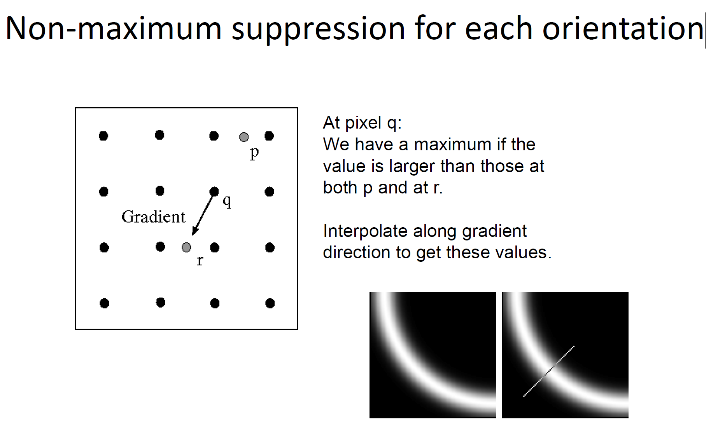

-   “滞后”的阈值
    -   定义两个阈值:低和高
    -   使用高阈值开始边缘曲线，使用低阈值继续它们
    -    ' Follow '边缘从强边缘像素开始
    -   连接组件(Szeliski3.3.4)

## 6 特征点

也叫 兴趣点，关键点，通常被描述为局部特征

滤波 --》 边缘 --》 corners

特征点被用于：

-   图像对齐
-   三维重建
-   运动跟踪
-   索引与数据库检索
-   目标检测

