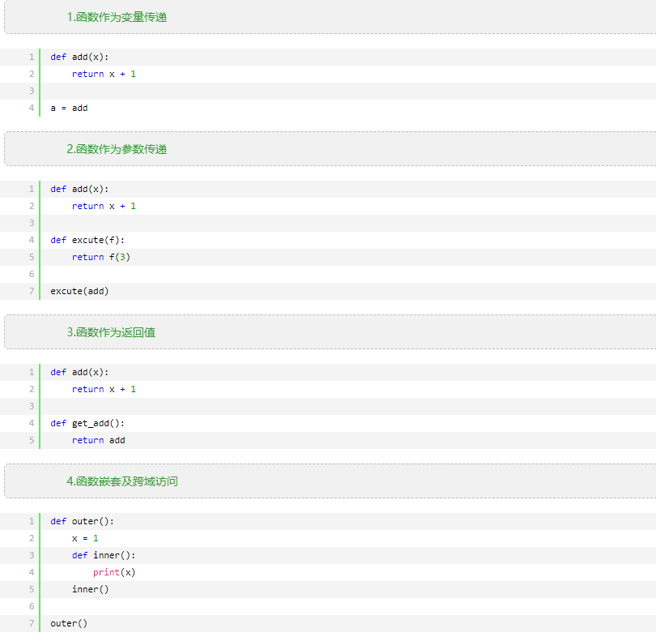
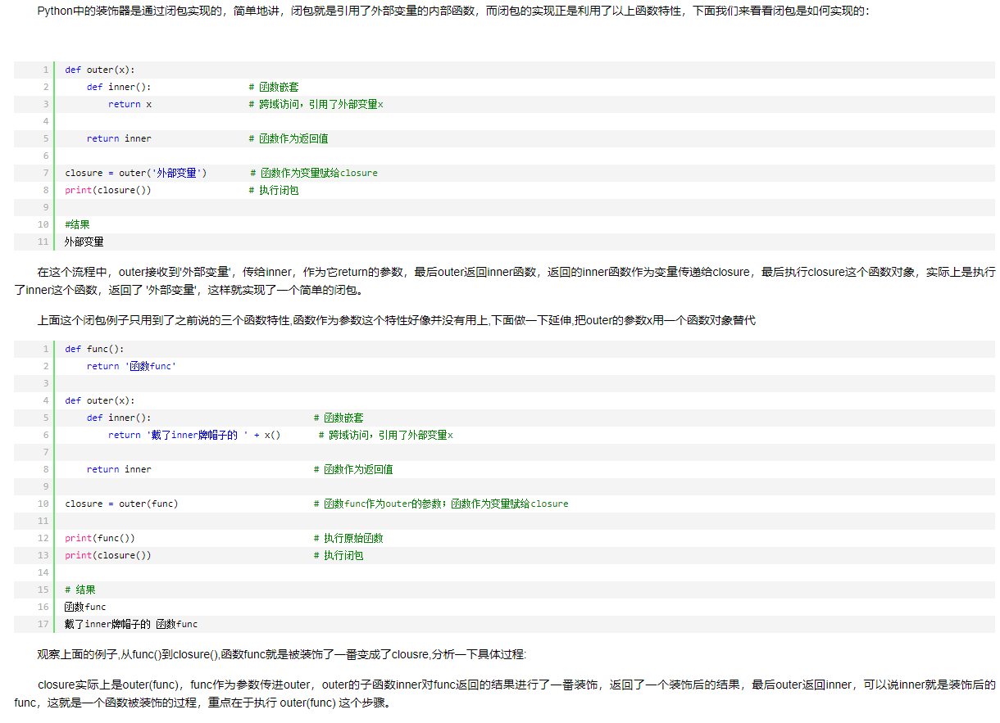
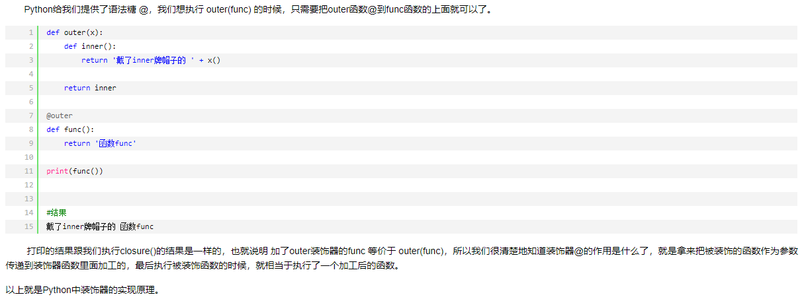

## 入门知识

## 类型和运算

## 语句和语法

## 函数

## 模块

这个问题困惑我很久了。。。。。。以前没有注意到的是，python 其实也有严格的包管理机制。我以前一直认为 python 就是那种，随便写，随便导包，任意文件都可以直接运行的。其实这样的想法是错误的。c/c++ 有严格文件包含管理机制，python 同样有。一般的原则是，将要运行的文件尽量放到根目录中，如果是放在子目录中，就要用绝对导入，如果用相对导入，需要在运行时告诉解释器目录结构，挺麻烦的。方法参考 [这篇博客](https://blog.csdn.net/ybw_2569/article/details/98775794)，除了要运行的文件必须用绝对导入外，其余文件可以用相对导入

## 类和 OOP

## 异常和工具

## 高级话题

## 归纳总结

### python 错误提示汇总

BaseException    所有异常的基类

SystemExit    解释器请求退出

KeyboardInterrupt    用户中断执行(通常是输入^C)

Exception    常规错误的基类

StopIteration    迭代器没有更多的值

GeneratorExit    生成器(generator)发生异常来通知退出

StandardError    所有的内建标准异常的基类

ArithmeticError    所有数值计算错误的基类

FloatingPointError    浮点计算错误

OverflowError    数值运算超出最大限制

ZeroDivisionError    除(或取模)零 (所有数据类型)

AssertionError    断言语句失败

AttributeError    对象没有这个属性

EOFError    没有内建输入,到达EOF 标记

EnvironmentError    操作系统错误的基类

IOError    输入/输出操作失败

OSError    操作系统错误

WindowsError    系统调用失败

ImportError    导入模块/对象失败

LookupError    无效数据查询的基类

IndexError    序列中没有此索引(index)

KeyError    映射中没有这个键

MemoryError    内存溢出错误(对于Python 解释器不是致命的)

NameError    未声明/初始化对象 (没有属性)

UnboundLocalError    访问未初始化的本地变量

ReferenceError    弱引用(Weak reference)试图访问已经垃圾回收了的对象

RuntimeError    一般的运行时错误

NotImplementedError    尚未实现的方法

SyntaxError    Python 语法错误

IndentationError    缩进错误

TabError    Tab 和空格混用

SystemError    一般的解释器系统错误

TypeError    对类型无效的操作

ValueError    传入无效的参数

UnicodeError    Unicode 相关的错误

UnicodeDecodeError    Unicode 解码时的错误

UnicodeEncodeError    Unicode 编码时错误

UnicodeTranslateError    Unicode 转换时错误

Warning    警告的基类

DeprecationWarning    关于被弃用的特征的警告

FutureWarning    关于构造将来语义会有改变的警告

OverflowWarning    旧的关于自动提升为长整型(long)的警告

PendingDeprecationWarning    关于特性将会被废弃的警告

RuntimeWarning    可疑的运行时行为(runtime behavior)的警告

SyntaxWarning    可疑的语法的警告

UserWarning    用户代码生成的警告

### python 装饰器

#### 1函数特性

Python中的函数特性总的来说有四点:




#### 2 闭包的实现



#### 3 装饰器语法糖@



##### 4 装饰器的使用

Python中装饰器用处很多,下面写一个例子感受一下.

类中的私有属性在类外部是无法访问的(就当无法访问好了,毕竟鬼叔是不推荐访问的),而这时可以在类中定义一个方法返回这个私有属性然后在外部调用就可以得到这个私有属性,但是这样看起来就和正常的调用属性的方式不一样了(obj.属性),这时候就可以用@property来实现想要的效果.

```python
class Person:
    def __init__(self,name,age):
        self.name = name
        if type(age) is int:
            self.__age = age
        else:
            print( '你输入的年龄的类型有误,请输入数字')
    @property
    def age(self):
        return self.__age

    @age.setter
    def age(self,a):
        '''判断,你修改的年龄必须是数字'''
        if type(a) is int:
            self.__age = a
        else:
            print('你输入的年龄的类型有误,请输入数字')

    @age.deleter
    def age(self):
        del self.__age


p1 = Person('帅哥',20)
print(p1.age)
del p1.age
```

### python 变量动态命名的方法

方法一，用内置 `exec` 函数

```python
for i in range(10):
    exec('food{} = turtle.Turtle()'.format(i))
```


方法二，用 `__import__` 函数

```python
def createInstance(module_name, class_name, *args, **kwargs):
  module_meta = __import__(module_name, globals(), locals(), [class_name])
  class_meta = getattr(module_meta, class_name)
  obj = class_meta(*args, **kwargs)
  return obj
obj = createInstance("test_module.my_module", "MyObject")
obj.test()
```

然后创建一个 python 包，包名： test_module

第一个文件， my_another_module.py

```python
class MyAnotherObject(object):
  def test(self):
    print ('MyAnotherObject.test')
```

第二个文件，my_module.py

```python
from test_module.my_another_module import *
class MyObject(object):
  def test(self):
    print ('MyObject.test')
    MyObject1().test()
    MyObject2().test()
    MyAnotherObject().test()
class MyObject1(object):
  def test(self):
    print('MyObject1.test')
class MyObject2(object):
  def test(self):
    print ('MyObject2.test')
```

## 参考资料

python 学习手册 第 4 版

