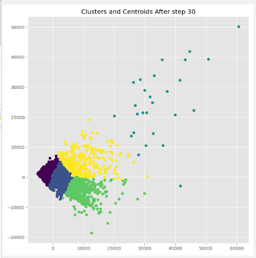

## python 实现 kmeans聚类算法

基本思想：初始随机给定 k 个簇中心，按最邻近原则（欧式距离？？）把待分类样本（任意样本？）点分到各簇。然后按平均法计算各个簇的质心，从而确定新的簇心。一直迭代，指导簇心的移动距离小于某个给定的值。

特点：

1.  类别的个数是人为给定的
2.  数据之间的相似度可以用欧式距离度量，如果不能用欧式距离度量，要先把数据转换到能用欧式距离度量

下面演示以信用卡数据为例子的 kmeans 聚类算法实现的代码

```python
import time
import numpy as np
import pandas as pd
import matplotlib.pyplot as plt
from sklearn.decomposition import PCA


class CustomKMeans:

    # 初始化参数
    def __init__(self, k, stop_var=1e-03, dist_type='l2', max_iter=300):
        self.inertia_ = 0  # 样本点距离聚类中心的距离和
        self.num_cluster = k
        self.max_iter = max_iter
        self.stop_var = stop_var
        self.dist_type = dist_type
        self.variance = 10 * stop_var
        self.dists = None
        self.labels = None
        self.centers = None

    def l1_distance(self, sample):
        return np.sum(np.abs(sample - self.centers), axis=1)

    def l2_distance(self, sample):
        return np.sqrt(np.sum(np.square(sample - self.centers), axis=1))

    def update_dists(self, samples):
        labels = np.empty(samples.shape[0])  # shape: [N, 1]
        dists = np.empty((0, self.num_cluster))  # shape: [N, n_cluster]
        for i, sample in enumerate(samples):
            if self.dist_type == 'l1':
                dist = self.l1_distance(sample)
            elif self.dist_type == 'l2':
                dist = self.l2_distance(sample)
            else:
                raise ValueError('..')
            labels[i] = np.argmin(dist)  # 距离最小的center就是该样本对应的类
            dists = np.vstack((dists, dist[np.newaxis, :]))  # 将该样本对应的各个center距离加入到dists中
        if self.dists is not None:
            self.variance = np.sum(np.abs(self.dists - dists))
        self.dists = dists  # 更新
        self.labels = labels  # 更新

    def update_centers(self, samples):
        centers = np.empty((0, samples.shape[1]))
        for i in range(self.num_cluster):
            mask = (self.labels == i)
            center_samples = samples[mask]
            if len(center_samples) != 0:
                center = np.mean(center_samples, axis=0)
            else:
                center = self.centers[i]
            centers = np.vstack((centers, center[np.newaxis, :]))
        self.centers = centers

    # 找到 k 个聚类中心点，然后标记每个数据属于哪个类
    def fit(self, data, plot_steps=False):
        # 主成分分析，降维到二维
        self.pca = PCA(2).fit(data)
        self.data = pd.DataFrame(data)
        self.data_pca = pd.DataFrame(self.pca.transform(data))
        self.data_pca.columns = ['PCA1', 'PCA2']

        self.iteration = 1
        n = data.shape[0]

        # 降维后，在 n 个数据中，随机选取 k 个聚类中心
        samples = self.data_pca.values  # 待聚类样本
        init_row = np.random.randint(0, self.data_pca.values.shape[0], self.num_cluster)
        self.centers = samples[init_row]
        for cur_iter in range(self.max_iter):
            self.update_dists(samples)  # 更新样本到各个 centers 的距离, 同时更新每个样本点对应的center类
            self.update_centers(samples)  # 更新各个 centers
            if self.variance < self.stop_var:  # 如果 centers 更新停止, 则提前退出
                print("cur_iter:", cur_iter)
                break

            if plot_steps:
                self.plot_state()
                self.iteration += 1

        for i in range(self.dists.shape[0]):
            self.inertia_ += self.dists[i].min()
        return self

    def plot_state(self):

        plt.figure(figsize=(8, 8))
        plt.scatter(self.data_pca['PCA1'], self.data_pca['PCA2'], c=self.labels)
        plt.title("Clusters and Centroids After step {}".format(self.iteration))
        plt.show()


if __name__ == "__main__":
    plt.style.use('ggplot')
    # 测试数据为 8950 个信用卡账户信息，每个账户有 17 个数据，通过 kmeans 聚类算法将这些账户分类
    data = pd.read_csv("creditcards.csv")
    print(f"{data.shape[0]} rows, {data.shape[1]} columns")
    print(data.head(10))

    K = 5  # 默认分为 5 类
    tic = time.perf_counter()
    custom_labels = CustomKMeans(K).fit(data, plot_steps=True)
    toc = time.perf_counter()
    print(f"Clustered {data.shape[0]} datapoints in {toc - tic:0.4f} seconds")

    # 可视化 分类数量从 2 到 20 时，所有样本点到聚类中心的总距离的变化情况
    sum_of_distances = []
    max_k = 20
    for k in range(2, max_k):
        kmean = CustomKMeans(k).fit(data)
        sum_of_distances.append(kmean.inertia_)

    fig = plt.figure(figsize=(9, 6))
    plt.plot(range(2, max_k), sum_of_distances, '--x')
    plt.title("Cost vs # Clusters")
    plt.xlabel("# Clusters")
    plt.ylabel('Cost')
    plt.show()
```

运行结果图




[源代码链接](https://github.com/MIXALER/python_projects/tree/master/kmeans)

