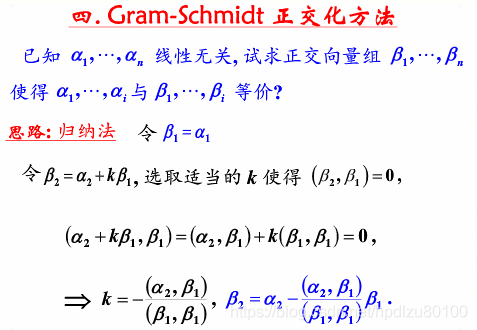
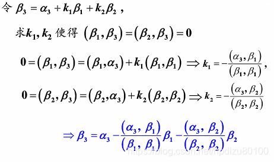
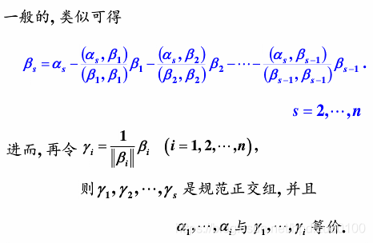
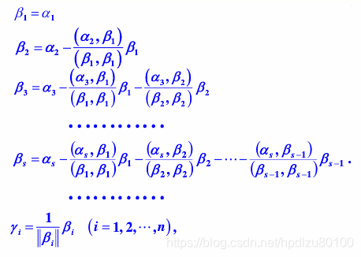
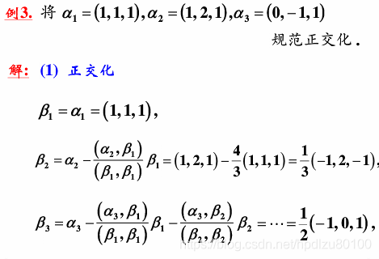
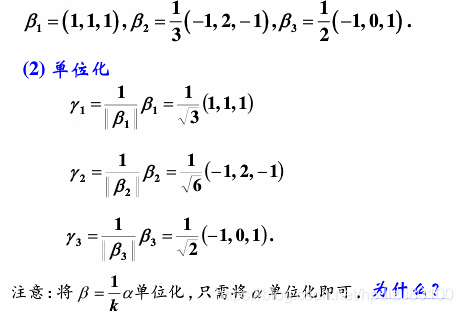

线性代数中，经常需要求 n 个 n 维线性无关向量的 n 个等价正交向量。用到的是 Gram-Schmidt 正交化方法

方法如下：









正交规范化示例





资料来源： https://blog.csdn.net/hpdlzu80100/article/details/100677372

下面就通过 python 来实现这一过程

-   如果输入的是 n 个 n 维线性无关的向量，输出的是 n 个正交的长为 1 的向量
-   如果输入的 n 个 n 维向量线性相关，输出的是包含有零向量的 n 个向量，非零向量相互正交

其实现如下

-   通过 numpy

```python
def my_gramSchmidt_np(vectors):
    def proj(x, u):
        u = unit_vec(u)
        return np.dot(x, u) * u

    def unit_vec(x):
        return x / np.linalg.norm(x)
    vectors = np.atleast_2d(vectors)

    if len(vectors) == 0:
        return []

    if len(vectors) == 1:
        return unit_vec(vectors)

    u = vectors[-1]

    basis = my_gramSchmidt_np(vectors[0:-1])

    w = np.atleast_2d(u - np.sum(proj(u, v) for v in basis))
    basis = np.append(basis, unit_vec(w), axis=0)

    return basis


def gram_schmidt_np(V):
    # YOUR CODE HERE
    if type(V) is not np.ndarray:
        raise ValueError
    else:
        if V.shape[0] != V.shape[1]:
            raise ValueError

    vectors = np.array(V)
    vectors = np.transpose(vectors)
    vectors = vectors.tolist()
    vectors = my_gramSchmidt_np(vectors)
    dim = np.linalg.matrix_rank(vectors)

    if dim == vectors.shape[0]:
        return vectors
    else:
        vectors = np.transpose(vectors)
        for i in vectors:
            for pos, j in enumerate(i):
                if pos >= dim:
                    i[pos] = 0

        return vectors
```

-   通过 sympy

```python
def my_gramSchmidt_sp(*vectors):
    normalize = True

    def project(a, b):
        return b * (a.dot(b, hermitian=True) / b.dot(b, hermitian=True))

    def perp_to_subspace(vec, basis):

        components = [project(vec, b) for b in basis]

        if len(basis) == 0:
            return vec

        return vec - reduce(lambda a, b: a + b, components)

    ret = []
    vectors = list(vectors)

    while len(vectors) > 0 and vectors[0].is_zero_matrix:
        del vectors[0]

    for vec in vectors:
        perp = perp_to_subspace(vec, ret)

        if not perp.is_zero_matrix:
            ret.append(Matrix(perp))

    if normalize:
        ret = [vec / vec.norm() for vec in ret]

    return ret

def gram_schmidt_sp(V):
    # YOUR CODE HERE
    if type(V) is not sympy.MutableDenseMatrix:
        raise ValueError
    if len(V.tolist()) != len(V.tolist()[0]):
        raise ValueError
    V = np.array(V)
    V = np.transpose(V)
    V = Matrix(V)
    vlist = V.tolist()
    tmp_list = []
    for i in vlist:
        tmp_list.append(Matrix(i))
    result = my_gramSchmidt_sp(*tmp_list)
    if len(result) == len(tmp_list):
        ma_list = []
        for i in result:
            tmp_list = []
            for j in i:
                tmp_list.append(j)
            tmp = tmp_list
            ma_list.append(tmp)

        result = Matrix(ma_list)
        return result
    else:
        ma_list = []
        for i in result:
            tmp_list = []
            for j in i:
                tmp_list.append(j)
            tmp = tmp_list
            ma_list.append(tmp)
        result = Matrix(ma_list)
        result = Matrix(result).H
        result = result.row_join(Matrix([[0], [0]]))
        return result
```

下面是测试代码

```python
# Check that it works for a specific matrix V of linearly independent vectors.
V = np.array([[1, 2], [3, 4]])
W = np.array([[0.31622777, 0.9486833], [0.9486833, -0.31622777]])
W1 = gram_schmidt_np(V)
difference = np.linalg.norm(W1 - W)
assert_almost_equal(difference, 0, delta=1e-8)

# Check that it works for a case when vectors are linearly dependent
V = np.array([[1, 2], [2, 4]])
W = gram_schmidt_np(V)

W1 = np.array([[0.4472136, 0.], [0.89442719, 0.]])
difference = np.linalg.norm(W1 - W)
assert_almost_equal(difference, 0, delta=1e-8)

assert_raises(ValueError, gram_schmidt_np, 1)
assert_raises(ValueError, gram_schmidt_np, np.array([[1, 2], [3, 4], [5, 6]]))

V = sympy.Matrix([[1, 2], [3, 4]])
W = sympy.Matrix([[sympy.sqrt(10) / 10, 3 * sympy.sqrt(10) / 10], [3 * sympy.sqrt(10) / 10, -sympy.sqrt(10) / 10]])
W1 = gram_schmidt_sp(V)

# W1.row_join()
assert_equal(W - W1, sympy.zeros(2, 2))

V = sympy.Matrix([[1, 2], [2, 4]])
W = sympy.Matrix([[sympy.sqrt(5) / 5, 0], [2 * sympy.sqrt(5) / 5, 0]])
W1 = gram_schmidt_sp(V)

assert_equal(W - W1, sympy.zeros(2, 2))

assert_raises(ValueError, gram_schmidt_sp, 1)
assert_raises(ValueError, gram_schmidt_sp, sympy.Matrix([[1, 2], [3, 4], [5, 6]]))
```

