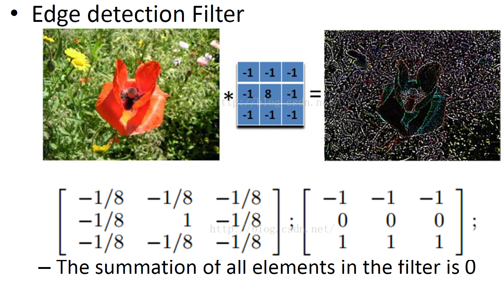

## 1 介绍

选择，填空，简答，计算题 积分图的计算 滤波器计算（有时有判断）

神经网络方法和传统方法的区别，简单神经网络的基本结构（多层感知机），非线性函数的用途，前向传播，卷积层的引入原因，卷积层和池化层的类型，池化的作用，卷积层的输入输出的计算，反向传播的原理，随机梯度下降的特点，正则化和dropout特点

神经网络部分

传统的方法代表的位置在哪里，，简单的神经网络基本机构（MMP，怎么描述基本使用），层级结构特点

Pro2为什么要使用非线性函数

MLP网络的特点和基本运算

卷积神经网络部分

卷积层特点，为什么要引入

卷积层和池化层的作用，类型

卷积核大小，步长。。。。等参数

给定网络反推各种参数

反向传播算法基本原理

随机剃度下降方法特点

改善网络训练的方法rg和dropout的特点

## 2 光线和颜色

颜色空间及关系，灰度矩阵rgb矩阵的特点，颜色划分关系，图像矩阵表示形式，特点，灰度，三色特点

图片是什么

在计算机中，是一个三维的张量（彩色），二维张量（黑白）

图像的维度，以 256*256 的 8bit 黑白图像为例，那么它的维度为 256 * 256 * 2^8 = 2^24 ，即计算机视觉任务处理的数据是一个非常高维度的空间中

颜色空间及其关系

RGB 颜色空间

HSV 颜色空间

YCbCr 颜色空间

## 3 滤波器

滤波和卷积的计算规则，以及不同滤波器（中值滤波器）特点，卷积运算和滤波运算的区别

图像金字塔的原理和用途，图像的高低频特性，不考频谱分析和傅里叶变换，4-5 频域分析，混合图像图像金字塔的内容和原理

滤波器定义

一些典型滤波器

box filter 

将每个像素点替换成相邻像素点的平均值，达到了**去除尖锐特征**的效果

滤波器的作用：

-   图像增强
    -   去噪，变换大小，增强对比度
-   从图像中提取信息
    -   纹理，边缘，独特点
-   模式检测
    -   模板匹配

滤波和卷积 ，当滤波器是对称的时候，相关和卷积是相同的

线性滤波器的特征：

-   线性
-   平移不变性
-   任何线性的、移位不变的算子都可以表示为卷积

卷积的特征

-   交换律
-   结合律
-   分配律

重要的滤波器，高斯滤波

邻近像素的权重贡献

-   去除图像中的高频部分，使图像变得比 box filter 更平滑
-   高斯加上高斯也为高斯：所以两个小内核的高斯滤波重复可以得到大内核的高斯滤波一样的效果
-   可以分解为两个一维高斯的乘积

可分离性的用处：

可以加速运算，2 维卷积，可分离式卷积

几个常见的滤波器：均值滤波：

锐化滤波：

边缘检测滤波：

浮雕滤波：

高斯滤波：

总结：

图像的高低频特性，不考频谱分析和傅里叶变换，

空域中的图像滤波器

-   平滑，锐化，测量纹理

频域中的图像滤波器

-   修改图像的频率
-   去噪，采样，图像压缩

滤波器的大小为奇数

滤波器矩阵的所有元素和应该要等与 1，为了保证滤波前后图像的亮度不变。如果大于 1 ，图像会更亮，反之会更暗。如果和为 0，图像不会黑，但是会非常暗。

滤波后结果为负数或者大于255，截断或取绝对值。

协相关和卷积式图像处理最基本的操作，都是线性的，具有平移不变性

**卷积和协相关的差别是，卷积需要先对滤波矩阵进行 180 度的翻转，如果矩阵式对称的，两者没有差别**

平移不变性指我们在图像的每个位置都执行相同的操作。线性指这个操作式线性的，用每个像素的领域的线性组合来替代这个像素。

二维卷积过程是 4 层循环计算过程（卷积二层，图像两层（单通道）），不快，如果卷积核分离成一维的可以加快运算速度。

非线性滤波器

中值滤波：中值滤波就是排序。取卷积核像素的中间值

## 4 频域滤波，图像金字塔

https://blog.csdn.net/qq_36673141/article/details/78108857

奈奎斯特-香农采样定理

用离散的方式采样一个信号，采样频率必须大于等于 2 倍的 fmax

fmax 为输入信号的最大频率。

只有这样才能保证从采样信号重建原始信号

图像金字塔的原理和用途，

频域

为什么一张低分辨率图像任然能传达信息，丢失的信息是什么？

一张混合图像，从远处看和从近处看，为啥能得到不一样的结果

混合图像是静态图像，其观感随观看距离的变化而变化。基本的想法是，当高频信号可用时，它倾向于主导感知，但是，在远处，只能看到信号的低频(平滑)部分。通过混合一幅图像的高频部分和另一幅图像的低频部分，你会得到一幅混合图像，在不同的距离会产生不同的观感。

时域滤波这类方法直接对图像的像素进行卷积处理；

图像的高频和低频特性：

低频分量:主要对整副图像的强度的综合度量，描述大范围的信息

高频分量:主要是对图像边缘和轮廓的度量，高频成分描述具体的细节。

在灰度图像中，亮度变化小的区域主要是低频成分，而亮度变化剧烈的区域 (比如物体的边缘)主要是高频成分。

简言之，就是图像中像素灰度值变化快的就是高频部分，变化慢的就是低频部分。

在频域空间，图像的信息表现为不同频率分量的组合。如果能让某个范围内的分量或某些频率的分量受到抑制，而让其他分量不受影响，就可以改变输出图的频率分布，达到不同的增强目的。

（1）将图像从图像空间转换到频域空间；

（2）在频域空间对图像进行增强；

（3）将增强后的图像再从频域空间转换到图像空间。

低通滤波保留图像中的低频分量而除去高频分量。

高通滤波保留图像中的高频分量而除去低频分量。

图像中的边缘和噪声都对应图像傅里叶频谱中的高频部分，所以低通滤波可以除去或消弱噪声的影响并模糊边缘轮廓。

图像金字塔：

[图像金字塔](https://zhuanlan.zhihu.com/p/112040797)

**高斯金字塔(Gaussian pyramid):** 用来向下采样（主要）

**拉普拉斯金字塔(Laplacian pyramid):** 用来从金字塔低层图像重建上层未采样图像，可以对图像进行最大程度的还原，配合高斯金字塔一起使用。

接下来我们介绍一下这两种图像金字塔：

**一：高斯金字塔**

　高斯金字塔是最基本的图像塔。首先将原图像作为最底层图像G0（高斯金字塔的第0层），利用高斯核（5*5）对其进行卷积，然后对卷积后的图像进行下采样（去除偶数行和列）得到上一层图像G1，将此图像作为输入，重复卷积和下采样操作得到更上一层图像，反复迭代多次，形成一个金字塔形的图像数据结构，即高斯金字塔。

**二：拉普拉斯金字塔**

在高斯金字塔的运算过程中，图像经过卷积和下采样操作会丢失部分高频细节信息。为描述这些高频信息，人们定义了拉普拉斯金字塔(Laplacian Pyramid， LP)。用高斯金字塔的每一层图像减去其上一层图像上采样并高斯卷积之后的预测图像，得到一系列的差值图像即为 LP 分解图像。

在使用拉普拉斯金字塔操作中，实际上也就实现了上采样的过程

①：首先，将图像在每个方向扩大为原来的两倍，新增的行和列以0填充(0)

②：使用先前同样的内核(乘以4)与放大后的图像卷积，获得 “新增像素” 的近似值。

## 5 特征检测与匹配

https://www.cnblogs.com/wangguchangqing/p/8076061.html

https://chongg039.cn/post/advanced-computer-vision/

描述边缘 ：边缘是图像强度函数中变化很快的地方

但是噪声对边缘检测存在很大的影响

比如上述情况下，就无法从一阶导数函数种找到边缘信息，也就是说，差分滤波器对噪声有很强的响应。图像噪声导致像素看起来与它们的邻居非常不同。

一般情况下，噪音越大，响应越强

该如何办呢？

再加上高斯滤波

平滑和局部化之间的权衡

平滑导数去除噪声，但模糊边缘。在不同的尺度找到边缘。平滑越厉害，找到边缘的尺度越大。

重点是 harris 兴趣点提取，harris 角点检测算法

canny 边缘检测算法

sift 特征描述算法

特征匹配：欧式距离

一张大的图片，先进行 feature detection 用 DoG，然后进行 feature description 用 sift，然后结合 local descriptors 进行 matching， indexing，detection

边缘检测定义以及如何确定边缘点，canny检测器的基本原理和步骤，

边缘检测

-   目标：识别图像中的视觉变化(不连续性)。
-   直观地说，语义信息被编码在边缘中。
-   造成视觉边缘的“原因”是什么? 边缘由一系列的原因造成的
    -   表面正常的不连续
    -   深度不连续
    -   表面颜色不连续
    -   光照不连续

边缘可以用来做什么

-   提取信息，识别目标
-   帮助恢复几何和视点

设计一个边缘探测器

好的边缘检测器的原则

-   很好的探测：好的检测器能够找到所有的真实边缘，忽略噪声和其他因素
-   很好的定位：
    -   检测的边缘必须尽可能的和真实边缘相近
    -   对于每个真边缘点，检测器必须只返回一个点

边缘检测线索

-   边界上颜色、强度或纹理的差异
-   连续性和关闭
-   高阶信息

边缘检测现状

-   局部边缘检测效果较好
-   一些方法考虑到较长的轮廓
-   从数据中“学习”的现代方法。深度学习
-   对象和高级信息使用不当。

Canny检测器的基本步骤和原理，步骤特点，为什么这么设计

Canny 边缘检测器

-   可能是计算机视觉中应用最广泛的边缘检测器。
-   理论模型:阶跃边被加性高斯噪声破坏。
-   Canny 证明了高斯函数的一阶导数近似于优化信噪比和局部化乘积的算子。

Canny 检测器的步骤

-   用高斯函数的 x, y 导数对图像进行滤波 ，目的是平滑和去噪。用一个高斯矩阵乘以米格像素点及其领域，取其带权重的平均值作为最后的灰度值。
-   使用一阶有限差分计算梯度的赋值和方向：梯度表示灰度值变化的程度和方向，方法是通过点乘一个 sobel 算子得到不同方向的梯度值。

-   非极大值抑制：高斯滤波可能放大了边缘，通过过滤非最大值来使边缘宽度尽可能为一像素。
    -   细多像素宽“脊”到单像素宽

-   “滞后”的阈值，使用双阈值算法检测和连接边缘。
    -   定义两个阈值:低和高
    -   使用高阈值开始边缘曲线，使用低阈值继续它们
    -    ' Follow '边缘从强边缘像素开始
    -   连接组件(Szeliski3.3.4)

也叫 兴趣点，关键点，通常被描述为局部特征

滤波 --》 边缘 --》 corners

特征点被用于：

-   图像对齐
-   三维重建
-   运动跟踪
-   索引与数据库检索
-   目标检测

示例： 局部不变特征

检测点是可重复的和独特的，具有对图像变换不变性

-   外观变化(亮度、照明)
-   几何变化(平移，旋转，缩放)

全景图合成

找到一系列独立的关键点

提取每个兴趣点周围的特征描述符作为向量。

计算特征向量之间的距离，寻找对应。

好的特征的特点

-   可重复性：同样的特征可以在一些图像中发现，尽管几何和光度变换
-   每个特征不一样
-   比图像像素更少的特征，远远少于图像像素点
-   一个特征占据图像的较小区域，对混乱和闭塞鲁棒

角点检测的原理和计算方法，harris角点检测器的步骤（不考公式），

角点的定义：

-   角点是轮廓之间的交点
-   针对同一场景，即使是视角发生变化，角点通常具备稳定的特征
-   角点附近的区域的像素点的梯度无论是方向还是幅值都会有较大的变化。

corner detection 基本思想

使用一个固定大小的窗口在图像上进行任意方向上的滑动，比较滑动前后的窗口中像素灰度变化的程度。若沿任意方向的滑动都有较大的灰度变化，则认为该窗口中存在角点。

需要设计一个函数用来衡量滑动前后的灰度值变化，并设置一个阈值，当灰度变化超过这个阈值就认为存在角点。

-   透过一扇小窗户，我们或许能认出这一点。
-   我们希望任意方向的窗口移动能给强度带来很大的变化。

haris 角检测器

对每个 Window 计算 M 矩阵来得到 conerness score

寻找大于阈值的像素，该像素有较大的角度检测响应

找到局部最大值的像素，通过 nms

局部特征描述

图像表示，直方图

全局直方图来表示特征的分布

每个检测点的局部直方图

计算直方图的原因

-   质地 texture
-   局部定向梯度直方图
-   尺度不变特征变换 sift scale invariant feature transform

特征点匹配的特点和差别（变换，考简答题），

sift特征点检测的基本步骤，图像的最佳匹配

8 特征点匹配，图像基本变换（几何，全局，缩放，移位的差别）简述，sift特征点的基本步骤，图像匹配，怎么筛选最佳匹配点，最临近

生成 DOG 金字塔来构建（近似）尺度空间

空间极值点检测，初步探查关键点

稳定关键点的精确定位；

稳定关键点的方向信息匹配

关键点描述：对关键点周围的像素区域分块，计算块内的梯度方向直方图，4*4的块，8个方向信息，128维向量。

特征点匹配

标准1：

-   在特征空间中计算距离，在 128 维的 sift 向量中计算欧式距离
-   将距离最近的点进行匹配
-   忽略高于阈值的点

问题是阈值难以选择，非显著特征可能有很多接近匹配，只有一个是正确的

## 9 机器学习

从数据中学习并预测

可以说是计算机对其他科学领域最大的输出

我们将机器学习看作一个工具。不讲解每个学习方法的具体细节

机器学习问题

分类，聚类，回归，降维

降维

pca 主成分分析

-   创建一个基，其中轴代表从高到低的方差维度。
-   在数据维度中寻找相关性，以基于线性投影产生尽可能好的低维表示。

聚类

kmeans 算法

-   随机选取 k 个中心点
-   将每个样本点分配给最邻近（欧式距离）的中心点
-   计算每个大类的新的中心点（平均值最低）

如何选取聚类数量

-   尝试不同的聚类数量并查看性能，其实越多的聚类数量，性能越好。。。。

聚类算法的优缺点

-   优点
    -   容易实现
    -   简单快捷
    -   对数据有很好的表示
-   缺点
    -   需要选取 k 值
    -   对异常值敏感
    -   
    -   容易陷入局部最小值

分类

ImageNet 120 万张图片，1000 个类别，10 万张测试图片，Top 5 error 对比于 top 5 accuracy 意思是猜 5 次，其中一次对了就算对，五次全错就算错。

数据集划分，训练集，验证集，测试集

方差，偏差

欠拟合，高偏差低方差，高训练误差，高测试误差，模型过于简单

过拟合，低偏差高方差，低训练误差，高测试误差，模型过于复杂

更好地标记的数据比用不同的监督学习技巧更为重要

## 11 识别与词袋模型

图像识别中的词袋向量（缺点及解决方法，设计技巧）图像识别中的词袋向量（缺点及解决方法，设计技巧）11 图像识别，词袋向量的基本原理，过程，特点，设置等，缺点

识别是关于建模可变性的

对齐:拟合一个模型到两幅图像的特征(匹配)对之间的转换：

词袋模型的步骤：

1.  特征提取
    1.  用 sift 描述符
2.  学习"可视化词汇"
    1.  kmeans 聚类算法，如何选定聚类数量？太小无法表示所有的种类，太大就过拟合了
3.  用可视化词汇量化特征
    1.  统计特征点的频数分布，得到词袋向量

1.  用可见词的频率代表图像

## 12 实例检测

实例搜索中如何根据倒排索引，构建层级的树状结构与倒排索引的关系，树状结构中层级以及叶结点个数和搜索性能的关系，检索系统的准确率召回率折线，查询拓展策略的作用及原理、使用场景，空间确认方法的使用阶段，检测的各个步骤及使用的具体方法，hog了解，积分图的定义和运算属性，boosting的原理和应用，级联方法的思路和作用，

12 实例搜索，倒排索引对应步骤，如何构建层级树状结构，与倒标签的关系，形式，叶子结点与效果的规律，复杂度分析

13 检索性能评估，准确率，，，查询拓展，，空间确认方法使用阶段，

14 检测，检测流程设置，方法步骤，Hod了解，积分图的运算和属性，，，Boosting算法的原理和过程，，级联方法的过程和思路

实例搜索中如何根据倒排索引，构建层级的树状结构与倒排索引的关系，树状结构中层级以及叶结点个数和搜索性能的关系，

检索系统的准确率召回率折线

查询拓展策略的作用及原理、使用场景，

空间确认方法的使用阶段，

检测的各个步骤及使用的具体方法，

-   指定对象模型
-   生成假设
    -   滑动窗口
    -   区域提案
-   对假设评分
    -   
-   得到检测结果
    -   非极大值抑制算法

hog了解

梯度分布直方图

## 14 积分图

https://blog.csdn.net/liulina603/article/details/8617281

积分图的定义和运算属性，boosting的原理和应用，级联方法的思路和作用，

积分图像快速特征评估

积分图的定义：

boosting 对于特征选择

步骤：

1.  找出加权训练误差最小的弱分类器。
2.  提高现有弱分类器误分类的训练实例的权重。
3.  计算最终分类器为所有弱分类器的线性组合。
4.  每个分类器的权重与其精度成正比。

级联方法的思路和作用，

## 17 神经网络与 cnn

神经网络方法和传统方法的区别，

传统方法有针对性和局限性，不同的问题需要不同的网络设计

传统方法提取特征过于复杂，且需要很高的人工经验知识

NN 具有非线性关系

NN 具有自适应，自组织，自学习能力

NN 具有不可解释性

NN 更加耗时和计算量更大

简单神经网络的基本结构（多层感知机），

非线性函数的用途，

相反如果使用非线性函数，激活函数给神经元引入了非线性因素，使得神经网络可以任意逼近任何非线性函数，这样神经网络就可以应用到众多的非线性模型中

卷积层的引入原因，

降低感受域，降低参数，局部连接，权值共享

卷积层和池化层的类型，池化的作用

卷积层的输入输出的计算，反向传播的原理，随机梯度下降的特点，

反向传播的原理

对网络中所有权重计算损失函数的梯度，这个梯度会反馈给最优化算法，用来更新权值以最小化损失函数。

正则化和dropout特点

dropout 在训练过程中会随机丢掉部分神经元来减小神经网络的规模防止过拟合。

正则化避免数据权值过大，
